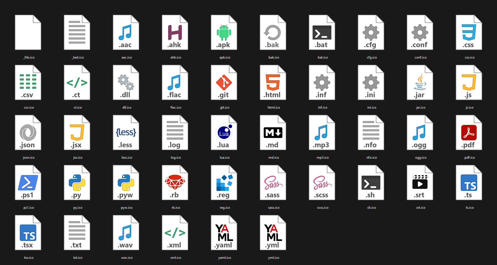

# File Type Icons - W11

Collection of file icons designed to blend into windows 11.

## About

Uses python to generate the different icons resolutions, which results in less blurry images than the traditional method of resizing full images.

Some icons are manually tweaked after to add in details or minor tweaks.

Icons come in resolutions 256, 48 and 16.\
These were decided on as they are the only sizes Windows' file explorer uses.

## Preview

